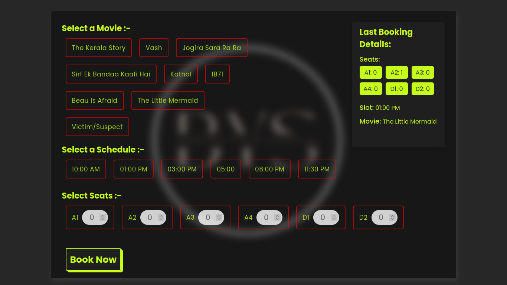

# Book Your Show

<h3 align="center">
  Book Your Show Website preview  
  
</h3>

 
<h5>This is a Ticket Booking website where the user can book a movie with specified seats at a specified slot and get a confirmation that, wheteher booking was sucessful or not.

The movie booked by the user will be stored in database and is retrived and shown to the user.</h5>

## 📖 Website's Live URL  
  https://book-your-show-ui.onrender.com/  
  (or you can just click on above image will redirect you to the website)

## ⭐ Technologies that are used.

### FrontEnd
- #### React  
    This app is fully built on top of react library.
- #### Axios / Fetch
    Used for making api calls.
- #### Context API
    for managing states and props.
- #### var()
    for global color.
- #### React-Toastify
    for showing Success alert on booking sucessfully  and error alert for any error to user.
    
## 🔹 aditionally 
-   I used Canva for Background Image

## 🛠 Installation and Setup Instructions

1. Installation: `npm install`

2. In the project directory, you can run: `npm start`

Runs the app in the development mode.\
Open [http://localhost:3000](http://localhost:3000) to view it in the browser.
The page will reload if you make edits.

##
<h4 align="center">Made with ❤️ from Anish</h4>
<h4 align="center">Thank You</h4>

